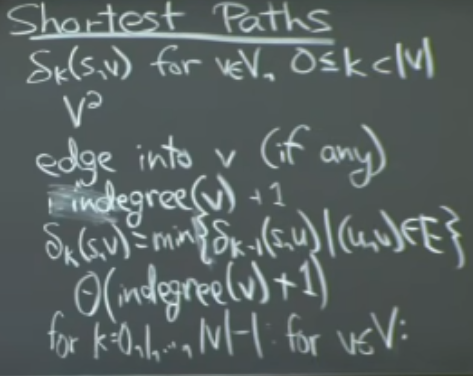
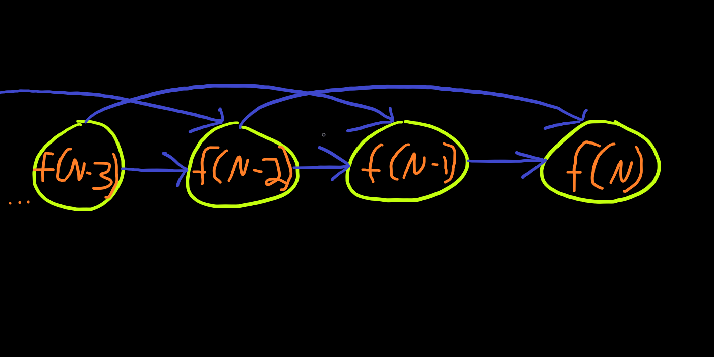

# dynamic-programming-MIT-ocw
A collection of dynamic programming problems and notes from MIT's OpenCourseWare program.

<b>A quick summarization/generalization of Dynamic Programming (DP):</b>
* a form of "careful bruteforce"
* composed of 3 main techniques: 1) Guessing + 2) Recursion + 3) memoization
* shortest paths in some DAG (Directed Acylical Graph)

#### Careful Bruteforce:
Technically, DP will still try every single possibility in a not-so-clever fashion, 
however, the cleverness comes by reusing smaller subproblems. By doing this you can
reduce runtime complexity from exponential to polynomial.

#### Techniques:

<b> Guessing:</b> the idea that we want to find the best way to solve a problem, 
lets pick out a feature of the solution we want to know and guess the answer 
(try all possibilites for that choice and take the best one)

<b> Recursion:</b> some way to express the solution to our problem as a way 
to solutions to subproblems. Useful if problem has some sort of substructure.

<b> Memoization:</b> stores these subproblems (from recursion) in a lookup table 
which brings search space down from exponential to polynomial as we do not need to
recompute subproblems each time (think Fibonacci).

#### DAG Shortest Path:
Another orthogonal perspective, DP is always computing shortest paths in a DAG.
Relates to the Bellman-Ford algorithm to calculate shortest paths for directed graph.

### Time Complexity:
time = #subproblems * (time/subproblem)

we get to count recursive calls as O(1). We only pay for it the first time because it
memoized. -- essentially an amortization.

### 5 "easy" steps to DP:
1) define subproblems   -> # of subproblems
2) guess (part of solution) -> # of guesses
3) relate subproblem solutions -> time/subproblem similar to # of guesses
4) recurse & memoize or bottom-up approach (DP table) -> check subproblem recurrence 
is acyclic i.e. has topological order. e.g. For Fibonacci we cannot start at fib(N) 
because we would need fib(N-1) and fib(N-2) and therefore we must 
topologically sort our subproblems
5) solve original problem

<b>Topological Sort - Fibonacci Example: </b>

#### Example DP problems-sets:

<b>Text Justification: </b> we want to split a document by words and right-justify
by some metric -- "good" lines.

Old versions of Microsoft Word use a greedy algorithm that just crams as many words
as it can per line, this may work well for the first few lines but has lasting effects
the further down you get. Let's use DP to justify our text in a smarter way. 
(minimization algorithm)

text is some list of words. 

We have some quantity that measures how bad our text is (this is what we want to 
minimize through a DP algorithm). Let words[i:j] describe a line of text 
including spaces.

Two cases:
1) if words[i:j] do not fit then set badness to infinity.
2) otherwise, words[i:j] does fit, (page width - total width)^3

#### applying the 5 "easy" steps to this problem:
1) define subproblems -> (suffixes) words[i:] when should a word start a new line?
2) guess -> how long is the first line (where does the second line begin)
3) recurrence -> DP[i] is solution to suffix words[i:]

<code> 
for j in range(i+1, n+1):
DP(J) + badness(i,j)
</code>

4) time/subproblem = O(N), check topological order. i = n,n-1,n-2,n-3,...0(base case)
5) original problem: DP(0) solved?

#### Resources:

[MIT OpenCourseWare](https://www.youtube.com/watch?v=ENyox7kNKeY)

